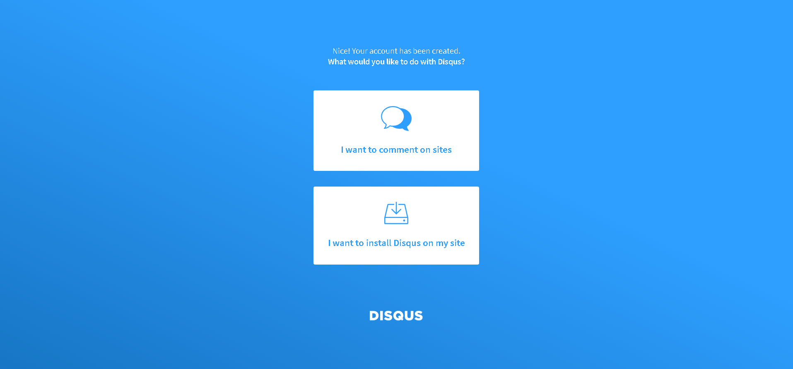
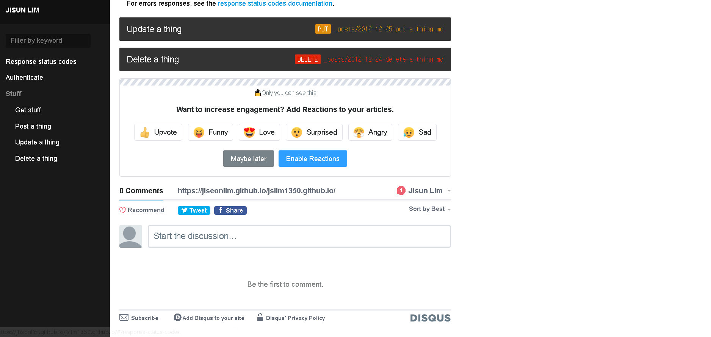

# disqus
disqus를 사용하면 github blog에 댓글 기능을 넣을 수 있다.

## disqus 가입하기
1. [disqus](https://disqus.com/) 사이트로 이동

2. `GET STARTED` 버튼 클릭

3. 계정이 없는 경우 `Signup`, 있는 경우 `Login`

4. 내 블로그에 적용할거니 `I want to install Disqus on my site` 클릭

5. 정보 입력


6. 무료 버전을 사용하려면 `Basic` 클릭


7. 본인의 사이트에 맞게 `platform` 선택 (이 블로그의 경우 Jekyll)

8. 제공된 코드를 알맞게 삽입


## disqus code 삽입하기
이 블로그의 경우에는 `index.html`, `assets.css` 파일을 수정했다.
`index.html`만 수정하는 경우 `disqus`가 `navigation`영역까지 침범하기 때문에 `assets.css`에서 `flex` 설정을 주었다.

```
---
layout: default
---

<nav id='sidebar'>
	
</nav>

<section id='content'>

  <article class='{{ post.type }}'>
    <a name='{{ post.url }}' href='#{{ post.url }}'><h2><code><b>{{ post.type }}</b> {{ post.path }}</code> {{ post.title }}</h2></a>
    <section class='body'>
      {{ post.content }}
    </section>
  </article>

	<div id="disqus_thread"></div>
    <script>
      /**
        *  RECOMMENDED CONFIGURATION VARIABLES: EDIT AND UNCOMMENT THE SECTION BELOW TO INSERT DYNAMIC VALUES FROM YOUR PLATFORM OR CMS.
        *  LEARN WHY DEFINING THESE VARIABLES IS IMPORTANT: https://disqus.com/admin/universalcode/#configuration-variables*/
      /*
        var disqus_config = function () {
        this.page.url = PAGE_URL;  // Replace PAGE_URL with your page's canonical URL variable
        this.page.identifier = PAGE_IDENTIFIER; // Replace PAGE_IDENTIFIER with your page's unique identifier variable
        };
      */
      (function() { // DON'T EDIT BELOW THIS LINE
      var d = document, s = d.createElement('script');
      s.src = 'https://https-jiseonlim-github-io-jslim1350-github-io.disqus.com/embed.js';
      s.setAttribute('data-timestamp', +new Date());
      (d.head || d.body).appendChild(s);
      })();
    </script>
    <noscript>Please enable JavaScript to view the <a href="https://disqus.com/?ref_noscript">comments powered by Disqus.</a></noscript>
</section>
```
```
body {
    margin: 0;
    display: flex;
}
#content {
  padding: 20px;
  padding-left: 260px;
  max-width: 700px;
  flex: 1;
}
```

## 완성!

